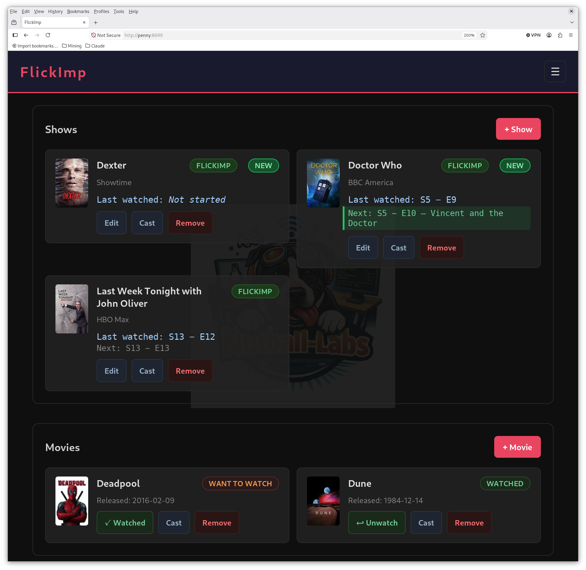

# FlickImp


A self-hosted web app for tracking the TV shows and movies you're watching — where you left off, what season and episode you're on, and how many episodes are left.

FlickImp is for people who watch across multiple streaming services and want a single private list they actually control. It runs as a lightweight HTTP daemon on your local machine or home server, serves a browser-based UI, and pulls episode data from IMDB so you always know how far you are through a series.

---

## Features

- **Show tracking** — track current season/episode, streaming service, and watch status (Watching / Finished)
- **Next episode title** — show cards display `Next: S3 − E5 — Episode Title` with the actual episode name fetched from TMDB
- **Season/episode picker** — click "Last watched" on any show card to open a popup with colour-coded seasons and a per-episode checklist; position tracks the last episode you explicitly watched
- **Episode browser** — click a show title to open a full-page episode browser with season navigation, episode cards, Watched checkboxes, and per-episode Cast buttons; clicking an episode title opens its TMDB / IMDB links
- **TMDB / IMDB links** — episode titles, show thumbnails, and movie titles all open a popup with direct TMDB and IMDB links; actor names in the cast modal link to their IMDB person page
- **Cast** — Cast button on show, movie, and episode cards opens a scrollable cast list with headshots; person lookups are cached cross-show so each actor is only resolved once
- **NEW badge and smart sort** — shows with unwatched aired episodes float to the top with a green NEW badge after running Check All
- **Movie list** — want-to-watch / watched list with tense-aware release date labels (Releases / Released / No release date yet)
- **TMDB integration** — search-on-add with live results; season lists, episode data, poster art, and release dates from TMDB; IMDB IDs back-filled automatically
- **Check All** — ☰ → Check All streams live progress for every active show and back-fills missing movie release dates
- **Responsive layout** — 2-column cards by default; 3 columns at ≥ 1200 px; 4 columns at ≥ 1600 px
- **About** — ☰ → About shows app version, copyright, and links
- **Browser UI** — dark-theme single-page app; dual watermarks (Nutball-Labs on main, FlickImp icon on episode browser)
- **REST API** — JSON API backing the UI; scriptable from curl or any HTTP client
- **SQLite storage** — single database file, no separate database server required
- **Qt6 configurator** (`flickimp-config`) — desktop app for service control and TMDB credential management

---

## Screenshots



See [screenshots/Screenshots.md](screenshots/Screenshots.md) for the full set — Add Show search, episode picker, episode browser, cast modal, service configurator, and About dialog.

---

## Installing

Download the package for your platform from the
[latest release](https://github.com/Nutball-Labs/FlickImp/releases/latest).
You'll need a free TMDB API Read Access Token from
<https://www.themoviedb.org/settings/api>.

| Platform | Package | Install |
|---|---|---|
| Alma / RHEL / Fedora | `flickimp-X.Y.Z-1.x86_64.rpm` | `sudo dnf install ./flickimp-*.rpm` — runs as a systemd service; configure with `flickimp-config` |
| Debian / Ubuntu | `flickimp_X.Y.Z_amd64.deb` | `sudo apt install ./flickimp_*.deb` |
| Windows 10 / 11 (x64) | `flickimp-X.Y.Z-win64.zip` | Extract, double-click `install.cmd` — per-user, starts at logon, no admin needed |
| macOS 11+ (Apple Silicon + Intel) | `flickimp-X.Y.Z-macOS.zip` / `.tar.gz` | Unpack, run `./install.sh` in Terminal — per-user, starts at login, no sudo needed |

Then browse to `http://localhost:8647`.

The Windows and macOS builds are unsigned: expect a SmartScreen "More info → Run anyway"
prompt on Windows. On macOS, `install.sh` clears the download quarantine flag.
See `README-Windows.txt` / `README-macOS.txt` inside each package for file locations,
upgrading and uninstalling.

### Docker

A `Dockerfile` and `docker-compose.yml` are included for running FlickImp in a container
on any Docker host. Config and the database live in `./data/` on the host:

```bash
mkdir -p data/config data/db          # create these yourself, or Docker makes them root-owned
cat > data/config/fi_config.json <<'JSON'
{ "tmdb_bearer_token": "your-TMDB-read-access-token" }
JSON
docker compose up -d --build
```

Then browse to `http://localhost:8647`. The container runs as UID 1000; if your host
user has a different UID, `chown -R 1000:1000 data` so the container can write the DB.
Upgrade with `git pull && docker compose up -d --build`.

---

## Building from Source

All platforms share the vendored dependencies, which are fetched by `get-deps.sh` / `get-deps.ps1`
(the build scripts run these automatically if `third_party/` is missing):

- SQLite amalgamation
- [cpp-httplib](https://github.com/yhirose/cpp-httplib)
- [nlohmann/json](https://github.com/nlohmann/json)

Each platform has `build-*`, `package-*` and `Go-*` (build + package, with sleep inhibited)
scripts in `scripts/`. Packages land in `packages/`.

### Linux (Alma / RHEL 9 — primary)

```bash
sudo dnf install cmake gcc-c++ libcurl-devel rpm-build   # + qt6-qtbase-devel for flickimp-config
git clone git@github.com:Nutball-Labs/FlickImp.git && cd FlickImp
./scripts/get-deps.sh
./scripts/build-linux.sh        # → build-linux/flickimp
./scripts/package-linux.sh      # → RPM, DEB, TGZ
```

### macOS 11+

```bash
xcode-select --install          # Apple clang + SDK; libcurl ships with macOS
brew install cmake
git clone git@github.com:Nutball-Labs/FlickImp.git && cd FlickImp
./scripts/Go-MacOS.sh           # build (universal arm64 + x86_64) + package → TGZ, ZIP
```

`./scripts/build-macos.sh --native` builds for the host architecture only (faster when you're iterating).

### Windows 10 / 11 (x64)

One-time toolchain setup, in PowerShell:

```powershell
winget install Microsoft.VisualStudio.2022.BuildTools Kitware.CMake Git.Git
#   → in Visual Studio Installer, tick "Desktop development with C++"
git clone https://github.com/microsoft/vcpkg C:\vcpkg
C:\vcpkg\bootstrap-vcpkg.bat -disableMetrics
[Environment]::SetEnvironmentVariable("VCPKG_ROOT", "C:\vcpkg", "User")
Set-ExecutionPolicy -Scope CurrentUser RemoteSigned
```

Then, in a new terminal:

```powershell
git clone git@github.com:Nutball-Labs/FlickImp.git; cd FlickImp
.\scripts\Go-windows.ps1        # build + package → packages\flickimp-X.Y.Z-win64.zip
```

libcurl comes from `vcpkg.json` (manifest mode) as a static library. The first configure builds it,
which takes a few minutes; later configures use the cache.

---

## Usage

Start the daemon from a build tree:

```bash
./build-linux/flickimp          # finds web/ next to the binary
```

Then open `http://localhost:8647` in your browser.

| Option | Meaning |
|---|---|
| `--port N` | HTTP port (default 8647, or `port` in `fi_config.json`) |
| `--web DIR` | Web assets directory (default: `web/` next to the binary) |
| `--log FILE` | Append output to FILE (used by the Windows/macOS autostart) |
| `--check` | Check TMDB for new episodes on all tracked shows, then exit |
| `--version` | Print version and exit |

`fi_config.json` holds the port and TMDB credentials. Its location depends on the platform:

| Platform | Config + database |
|---|---|
| Linux system service | `/etc/flickimp/fi_config.json`, `/var/lib/flickimp/db/` — use `flickimp-config` |
| Linux developer run | `~/.config/flickimp/`, `~/.local/share/flickimp/db/` |
| Windows | `%APPDATA%\flickimp\` |
| macOS | `~/Library/Application Support/flickimp/` |

---

## Project Status

**v1.5.0 — Windows and macOS packages.** The HTTP daemon and web UI (queues, episode browser, cast,
TMDB/IMDB links) run on Linux, Windows and macOS. The Qt configurator `flickimp-config` is Linux-only.
On Windows and macOS, the installer handles first-time configuration.

---

## Development Paradigm

FlickImp is built the same way as its sister projects
[TagGoblin](https://github.com/Nutball-Labs/TagGoblin) and
[CamClops](https://github.com/Nutball-Labs/CamClops) — a collaboration between
an experienced Linux sysadmin and Claude (Anthropic's AI), which handles the
C++ implementation under continuous human guidance and review. The architecture,
feature decisions, and real-world testing are entirely human-driven.

---

## License

GNU General Public License v3 — see [LICENSE](LICENSE).
Copyright (C) 2026 Nutball Labs / Stephen Berg

<!-- SN: 00006 -->

