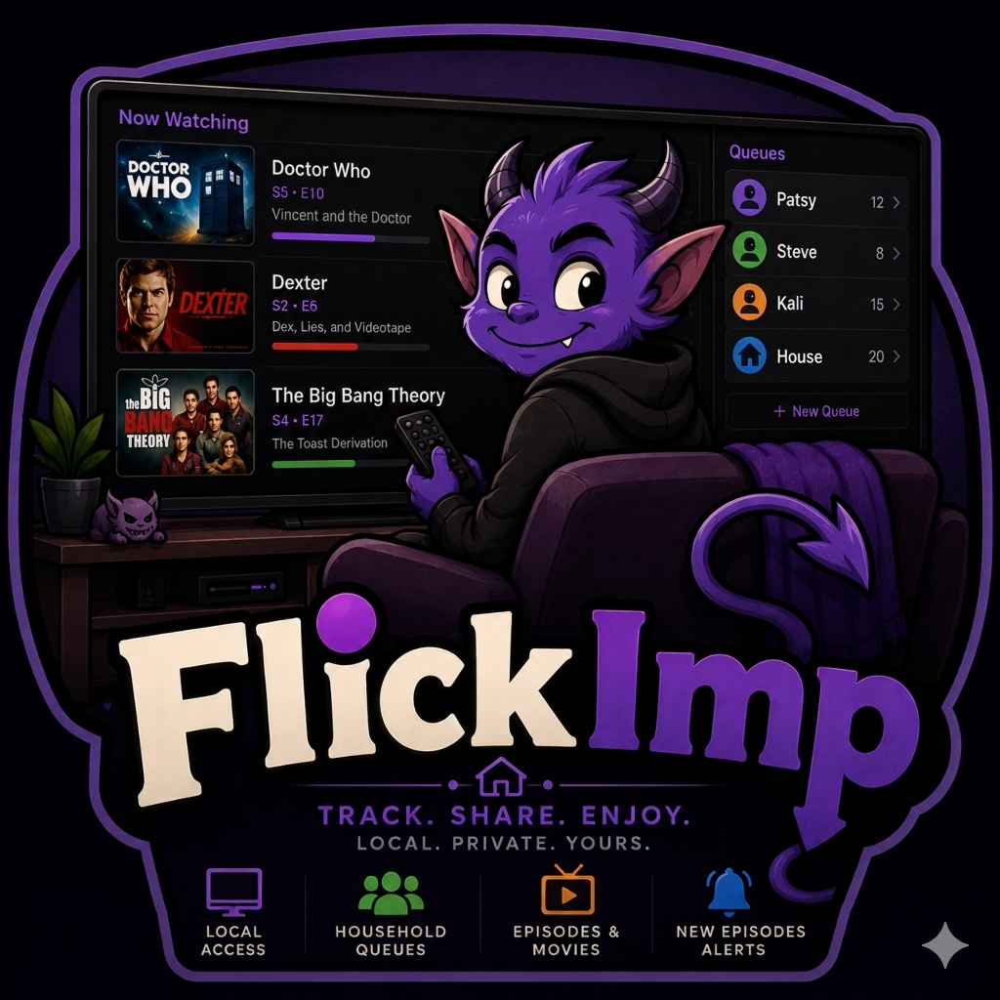

# FlickImp



A self-hosted web app for tracking the TV shows and movies you're watching — where you left off, what season and episode you're on, and how many episodes are left.

FlickImp is for people who watch across multiple streaming services and want a single private list they actually control. It runs as a lightweight HTTP daemon on your local machine or home server, serves a browser-based UI, and pulls episode data from IMDB so you always know how far you are through a series.

---

## Features

- **Show tracking** — track current season/episode, streaming service, and watch status (Watching / Finished)
- **Next episode title** — show cards display `Next: S3 − E5 — Episode Title` with the actual episode name fetched from TMDB
- **Season/episode picker** — click "Last watched" on any show card to open a popup with colour-coded seasons and a per-episode checklist; position tracks the last episode you explicitly watched
- **Episode browser** — click a show title to open a full-page episode browser with season navigation, episode cards, Watched checkboxes, and per-episode Cast buttons; clicking an episode title opens its TMDB / IMDB links
- **TMDB / IMDB links** — episode titles, show thumbnails, and movie titles all open a popup with direct TMDB and IMDB links; actor names in the cast modal link to their IMDB person page
- **Cast** — Cast button on show, movie, and episode cards opens a scrollable cast list with headshots; person lookups are cached cross-show so each actor is only resolved once
- **NEW badge and smart sort** — shows with unwatched aired episodes float to the top with a green NEW badge after running Check All
- **Movie list** — want-to-watch / watched list with tense-aware release date labels (Releases / Released / No release date yet)
- **TMDB integration** — search-on-add with live results; season lists, episode data, poster art, and release dates from TMDB; IMDB IDs back-filled automatically
- **Check All** — ☰ → Check All streams live progress for every active show and back-fills missing movie release dates
- **Responsive layout** — 2-column cards by default; 3 columns at ≥ 1200 px; 4 columns at ≥ 1600 px
- **About** — ☰ → About shows app version, copyright, and links
- **Browser UI** — dark-theme single-page app; dual watermarks (Nutball-Labs on main, FlickImp icon on episode browser)
- **REST API** — JSON API backing the UI; scriptable from curl or any HTTP client
- **SQLite storage** — single database file, no separate database server required
- **Qt6 configurator** (`flickimp-config`) — desktop app for service control and TMDB credential management

---

## Requirements

**Platform:** Linux (x86_64) — primary. macOS and Windows builds are in progress for v1.0.
Primary development and testing on Alma Linux 9.x / RHEL 9; other Linux distributions should work but are not regularly tested.

**Build dependencies:**

- g++ with C++17 support (GCC 11+ recommended)
- CMake 3.16+
- libcurl development headers

Install on Alma / RHEL:

```bash
sudo dnf install cmake gcc-c++ libcurl-devel
```

**Vendored dependencies** (fetched automatically by `get-deps.sh`):

- SQLite amalgamation
- [cpp-httplib](https://github.com/yhirose/cpp-httplib)
- [nlohmann/json](https://github.com/nlohmann/json)

---

## Building from Source

```bash
git clone git@github.com:Nutball-Labs/FlickImp.git
cd FlickImp
./scripts/get-deps.sh        # fetch vendored third-party headers
./scripts/build-linux.sh     # configure + build
```

The `flickimp` daemon binary lands in `build-linux/`.

---

## Usage

Start the daemon:

```bash
./build-linux/flickimp --port 8647 --web ./web
```

Then open `http://localhost:8647` in your browser.

Configuration is read from `/etc/flickimp/fi_config.json` when running as a system service (UID < 1000), or `~/.config/flickimp/fi_config.json` for local development. Use `flickimp-config` to set the port and TMDB credentials.

---

## Project Status

**v1.0.0 — Initial public release.** HTTP daemon, web UI, episode browser, cast with IMDB/TMDB links, About modal, TMDB integration, and Qt6 configurator are all functional. macOS and Windows builds coming soon.

---

## Development Paradigm

FlickImp is built the same way as its sister projects
[TagGoblin](https://github.com/Nutball-Labs/TagGoblin) and
[CamClops](https://github.com/Nutball-Labs/CamClops) — a collaboration between
an experienced Linux sysadmin and Claude (Anthropic's AI), which handles the
C++ implementation under continuous human guidance and review. The architecture,
feature decisions, and real-world testing are entirely human-driven.

---

## License

GNU General Public License v3 — see [LICENSE](LICENSE).
Copyright (C) 2026 Nutball Labs / Stephen Berg

<!-- SN: 00004 -->
