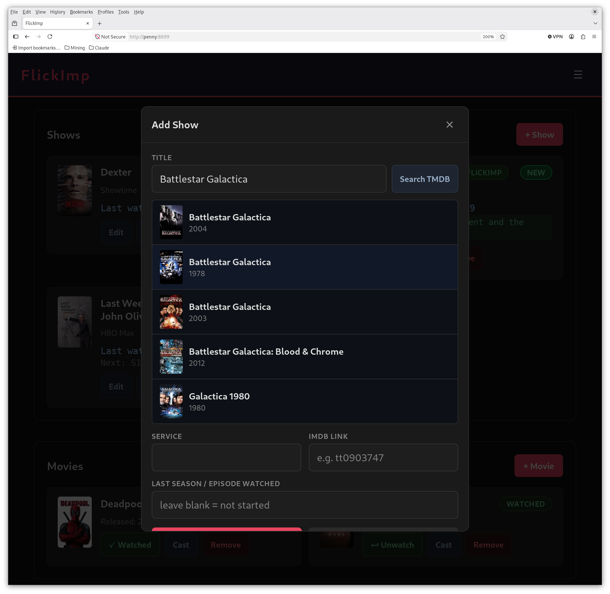
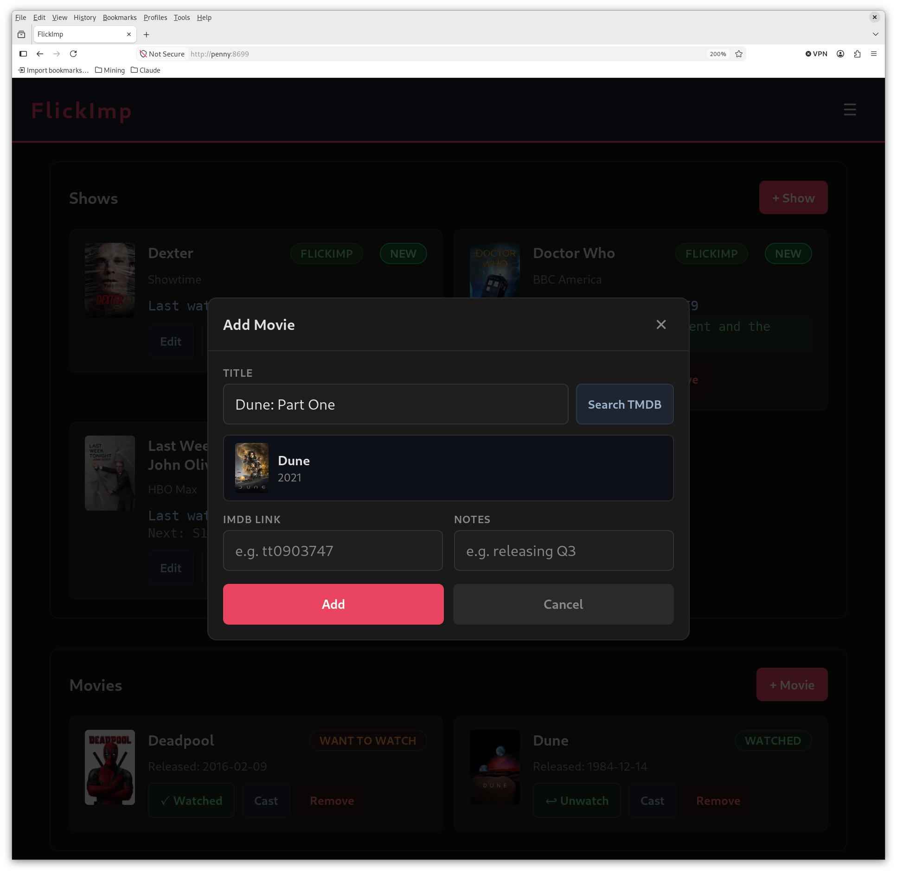
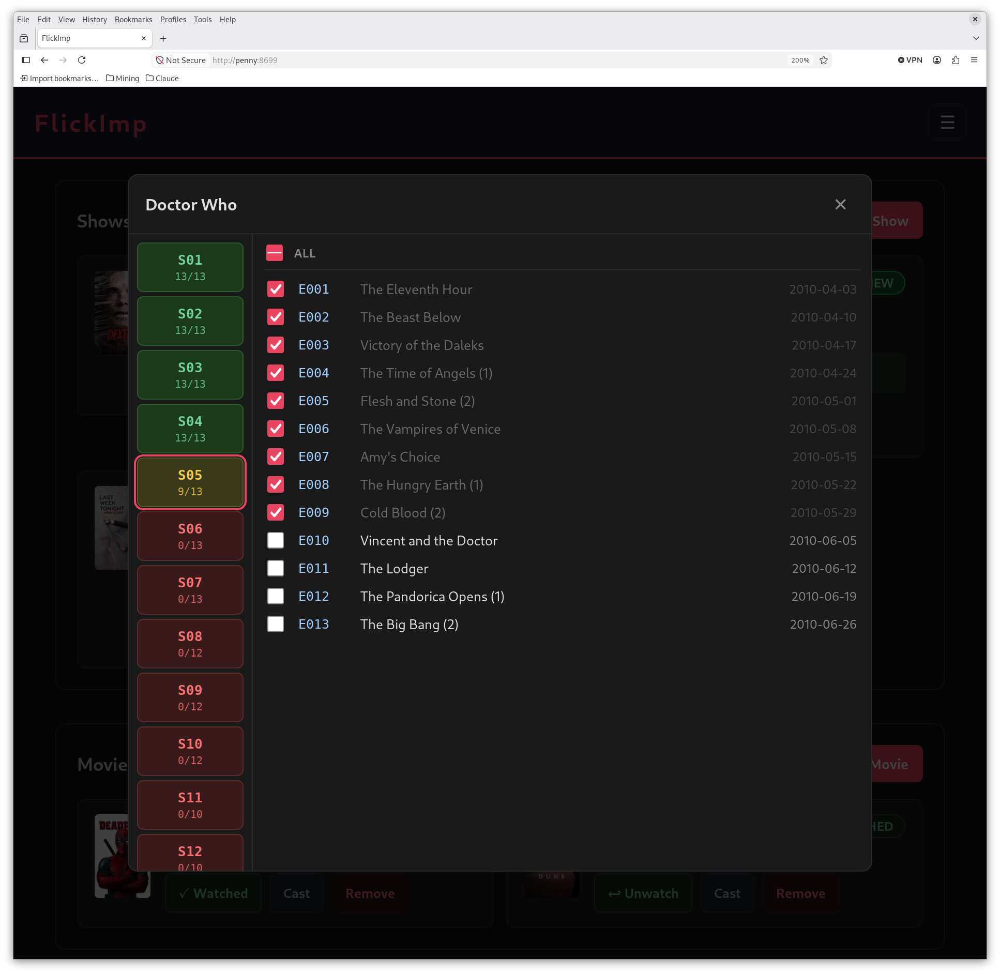
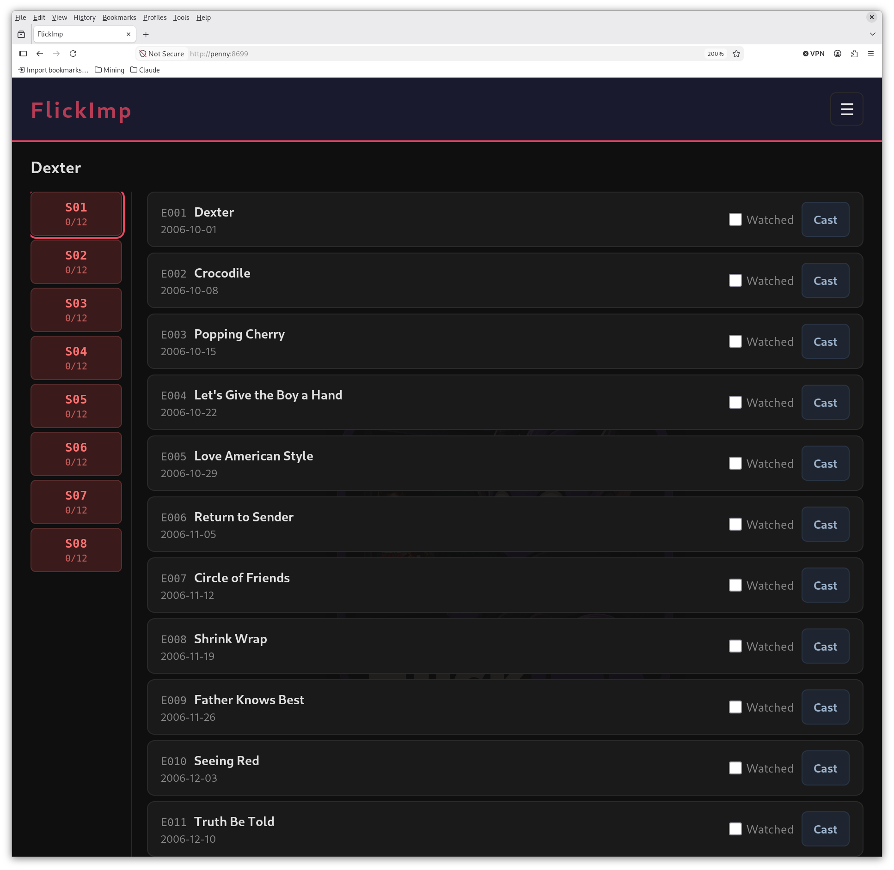
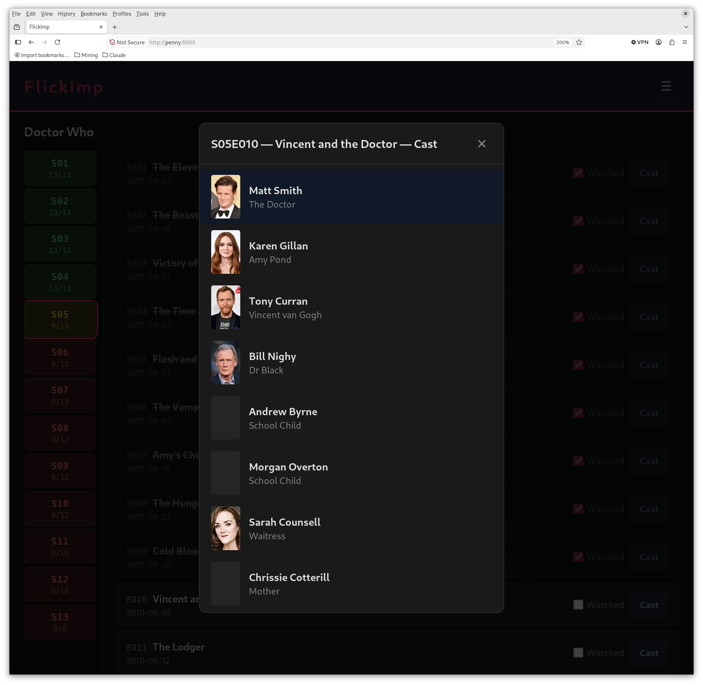
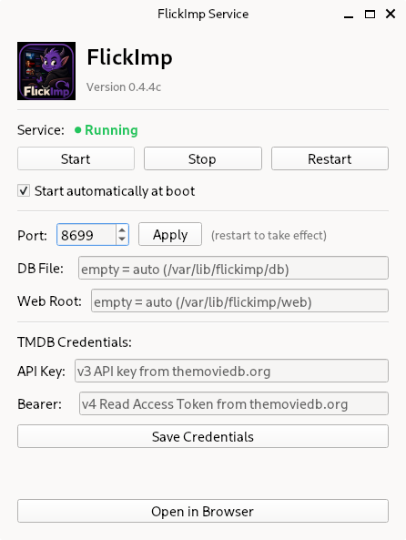
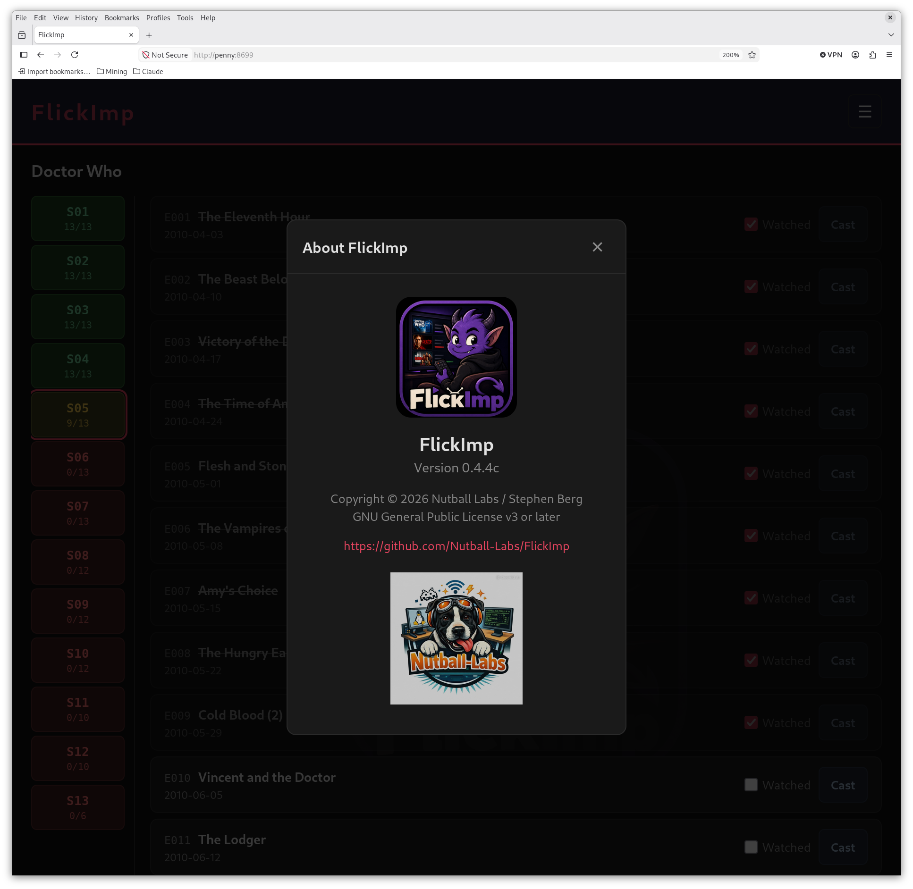

# FlickImp Screenshots

---

## Main View

The main page showing the Shows and Movies sections side by side. Show cards display the
series thumbnail (linked to IMDB), title, streaming service, last-watched position, and
next episode with title. Cards with new episodes float to the top with a green **NEW**
badge. The Nutball-Labs logo watermark is visible in the background.

---

## Adding a Show (TMDB Search)

The Add Show modal with a TMDB search in progress for "Battlestar Galactica". Up to
five results are returned with poster, title, and year — making it easy to pick the
right version when a title has multiple entries across different decades. Selecting a
result auto-populates the TMDB ID, thumbnail, and metadata.

---

## Adding a Movie (TMDB Search)

The Add Movie modal showing the same TMDB search flow, this time for "Dune: Part One".
Selecting a result auto-populates the TMDB ID, thumbnail, and release date — no manual
ID entry needed.

---

## Episode Picker

The quick episode picker modal for Doctor Who. The left pane lists every season with a
colour-coded watched-progress indicator (green = complete, orange = partial, red = none).
The right pane shows the episode list for the selected season with checkboxes; checking
an episode marks it watched and advances the Last Watched position on the card.

---

## Episode Browser

The full episode browser for Dexter, opened by clicking the show title. The left pane
shows all seasons; the right pane lists every episode in the selected season with its
air date, a Watched checkbox, and a Cast button. Clicking an episode title opens the
TMDB / IMDB link popup.

---

## Cast

The cast modal for Doctor Who S05E10 — Vincent and the Doctor. Actor photos, names
(linked to their IMDB person page), and character names are shown. Cast data is fetched
from TMDB and cached locally so repeat views load instantly.

---

## Service Configurator

The `flickimp-config` Qt desktop app. Shows the live service status with start / stop /
restart controls, boot-time enable toggle, port setting, and TMDB API credentials. The
**Open in Browser** button launches the web UI directly. The DB and web-root paths are
shown for reference.

---

## About

The About dialog (☰ → About) showing the FlickImp icon, version, license, GitHub repo
link, and Nutball-Labs logo.

<!-- SN: 00004 -->
